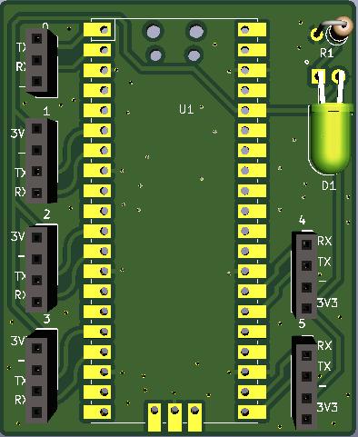

# Raspberry Pi Pico UART breakout
 A simple 2-layer PCB making the Raspberry Pi Pico a 6 way UART adapter.
 The main purpose of this board is to be the programmer for the AERQ project which uses UART 0 to pass LoRa credentials and other settings to the system.
<figure>

<figcaption>Figure 1: 3D simulation of the front of the board</figcaption>
</figure>

<figure>

<figcaption>Figure 2: 3D simulation of the back of the board</figcaption>
</figure>

# Hardware
The board uses  2.54mm holes for the UART ports and a resistor/LED to indicate the 3v3 bus. 

The board dimensions are: 44.75mm x 55mm 

### Why the curved traces?
No reason in particular, it was a test for [easyw's](https://github.com/easyw/RF-tools-KiCAD) plugin.

<figure>

<figcaption>Figure 3: Layout</figcaption>
</figure>

# Software
To make use of all the 6 UART ports available, use [harrywalsh's](https://github.com/ncarandini/KiCad-RP-Pico) software.

This will make the Pi Pico into a 6 way UART adapter, all the UART ports are marked on the board.

# Limits
<b>The maximum output on the 3v3 rail should not exceed ~ 300 mA.</b>

# License
This PCB uses [ncarandini's](https://github.com/ncarandini/KiCad-RP-Pico) footprint for the Raspberry Pi Pico.

# Disclaimer
This project/hardware is provided without warranty, according to the MIT License, and should therefore not be used where it may endanger life, financial stakes, or cause discomfort and inconvenience to others.